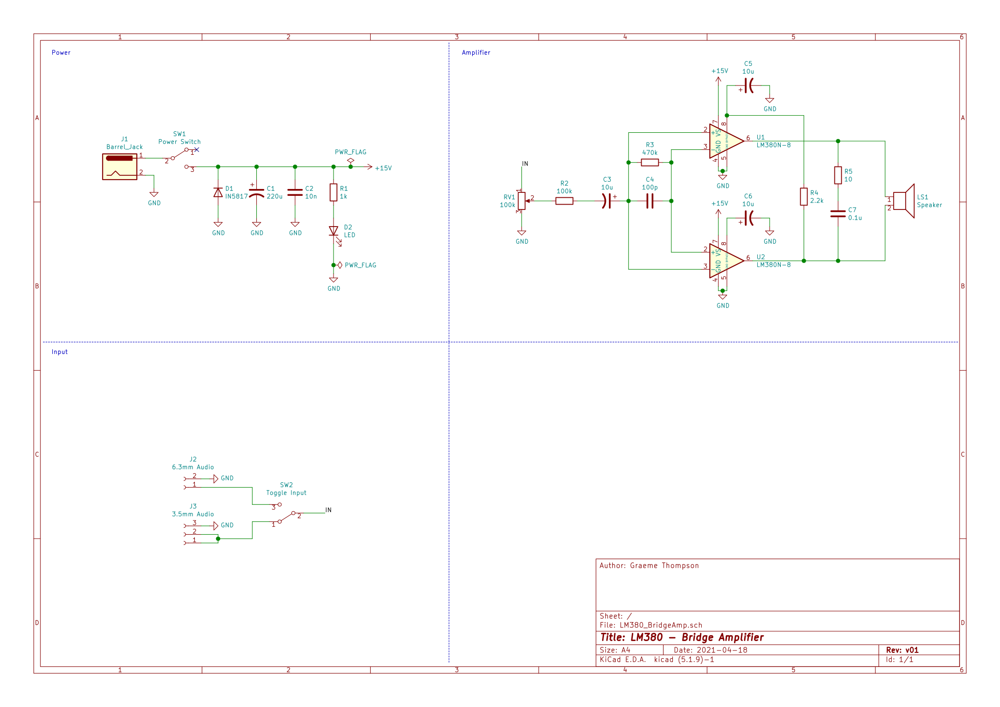
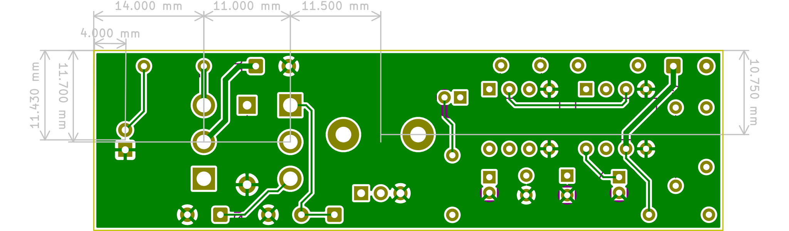

# simple-amp
This repository contains a KiCad project for a simple guitar bridge amplifier.

The board is designed to fit in a stomp box with panel mount switches.

## Schematic

## Board Layout
Top | Bottom
:---: | :---:
 | 

## Changelog

### v01
* Initial schematic and board layout
